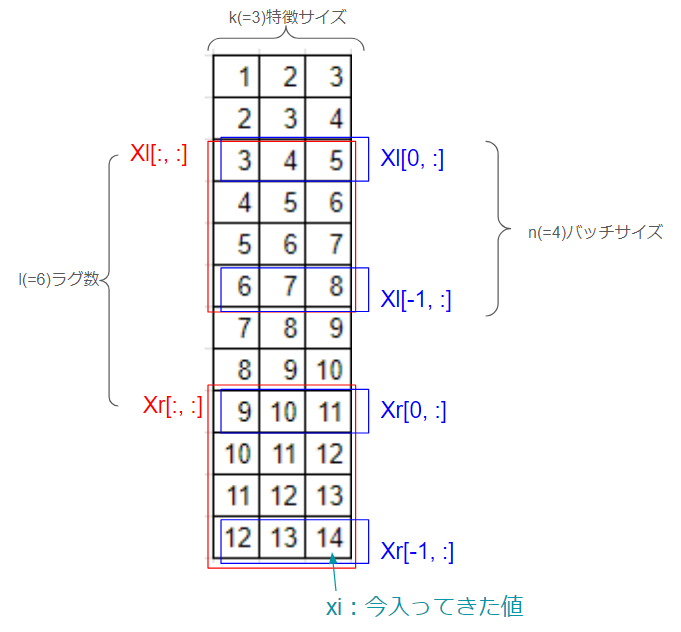

# cpd
change point detection

## CUMSUM
### お気持ち
今ままでの値より大きく外れているものが続いたら変化点。

### 擬似コード
- ハイパーパラメータ
    - $k$:累積を減衰させる値 
    - $h$:変化点を検出する閾値

0. $平均\muと分散\sigma^2、累積はずれ値SとTを初期化$
    - $\mu_0=0$
    - $\sigma_0^2=1$
    - $S_0=0$
    - $T_0=0$
1. $新しい値x_iが入ってくる$
1. $\muと\sigma^2を更新$
    - $\mu_i \gets \frac{n-1}{n}\mu_{i-1} + \frac{1}{n}x_i$
    - $\sigma_i^2 \gets \frac{n-2}{n-1}\sigma_{i-1}^2 + \frac{(x_i - \mu_i)(x_{i-1} - \mu_{i-1})}{n-1}$
1. $x_iを正規化$
    - $\hat{x}_i \gets \frac{x_i - \mu_i}{\sigma_i} $
1. $SとTを更新$
    - $S_i \gets max(0, S_{i-1} -k + \hat{x}_i)$
    - $T_i \gets max(0, T_{i-1} -k - \hat{x}_i)$
1. 変化点を検出
    - $S_i > h もしくは T_i > hならiは変化点$
    - $iが変化点の場合はS_i \gets 0, T_i \gets 0$
1. 1に戻る
### 解説
- $値が通常より大きいのをSで、小さいのをTでそれぞれ捉える$
- $両方kにより常に減衰する（\hat{x}_iはkより大きくならないとたまらない）$

## EWMA: Exponentially Weighted Moving Average algorithm

### お気持ち
今ままでの値より大きく外れているものがあったら変化点(CUMSUMとほぼ一緒)

### 擬似コード
- ハイパーパラメータ
    - $r:値を更新する際の現在の値の重み$
    - $L:この値*偏差値より値がズレていたら変化点$

0. $平均\muと分散\sigma^2、Zを初期化$
    - $\mu_0=0$
    - $\sigma_0^2=1$
    - $Z_0=0$
1. $新しい値x_iが入ってくる$
1. $xを更新$
    - $Z_i \gets (1-r)Z_{i-1}+rx_i$
1. $\muと\sigma^2を更新$
    - $\mu_i \gets \frac{n-1}{n}\mu_{i-1} + \frac{1}{n}x_i$
    - $\sigma_i^2 \gets \frac{n-2}{n-1}\sigma_{i-1}^2 + \frac{(x_i - \mu_i)(x_{i-1} - \mu_{i-1})}{n-1}$
1. 変化点を検出
    - $Z_i > \mu_i+L\sigma_Z もしくは Z_i < \mu_i-L\sigma_Z ならiは変化点$
1. 1に戻る
### 解説
- $現在の値のiirを取りながら、平均、分散の統計値より外れていたら変化点$
- CUMSUMと比べて、内部で正規化するか、変化点検出時に正規化するかの違い？

## Two-sample test algorithm

### お気持ち
変化点前後のデータの分布が異なるか検定する

### 擬似コード
- ハイパーパラメータ
    - $s:検定手法(例:Wilcoxonの順位和検定) $
    - $h:検定の閾値$

0. $xs値群を初期化$
    - $xs=[]$
1. $新しい値x_iが入ってくる→xを追加$
    - $xs.append(x_i)$
1. $現在のxs(サイズ=n)の各変化点候補で検定$
    1. $Ds = []$
    1. $kを2からn-2までfor文を回す$
        1. $kでxsを分割: xs1 = xs[1:k], xs2 = xs[k+1:n]$
        1. $D(xs1とxs2の分布が異なる確率)=s(xs1, xs2)$
        1. $Ds.append(D)$
    1. $もしmax(Ds)>h$
        - $Dsが最大の位置\tauが変化点: \tau=argmax(Ds)$
        - $\tauより前のxを削除: xs \gets xs[\tau:]$
1. 1に戻る
### 解説
- 最後の変化点から現在の値までの各位置で検定する
- 変化点が見つからないとどんどん計算量が増えていく→xsを保存するサイズの上限を設定する？

## Neural network for changepoint detection algorithm

### お気持ち
少し前と現在を見分けるNNをオンライン学習する。見分けられたら変化点。

### 擬似コード
- ハイパーパラメータ
    - $k:特徴サイズ$
    - $n:バッチサイズ$
    - $l:ラグ数$
    - $f_{\theta}:ニューラルネットワーク, \mathbb{R}^k \mapsto \mathbb{R}$

0.  初期化
    - $入力データ群: xs=[]$
    - $カルバックライブラーダイバージェンス群: Ds=[]$
    - $1つ前のdissimilarity: d_{prev}=None$
1. $新しい値x_iが入ってくる$
    - $xsに加える(FIFOでk-1+n+l個分保持する)$
1. $最近のバッチ(Xr:recent)と過去のバッチ(Xl:lagg)を作成$

1. $X_lとX_rのカルバックライブラーダイバージェンス(D)を計算して追加$
    - $D(\mathcal{X}_l, \mathcal{X}_r) = \frac{1}{n} \sum_{X \in \mathcal{X}_{l}} \log \left\{ \frac{1 - f_{\theta}(X)}{f_{\theta}(X)} \right\} + \frac{1}{n} \sum_{X \in \mathcal{X}_{r}} \log \left\{ \frac{f_{\theta}(X)}{1 - f_{\theta}(X)} \right\}$
        - $XはX_lやX_rの中の各特徴ベクトル$
    - $DsにDを加える(FIFOでl+n個分保持しておく)$

1. $dissimilarity(d)を計算して、変化を判断$
    1. $d=d_{prev}+\frac{D-Ds[-l-n]}{l}$
    1. $dの値を上で説明したEWMAなどの入力として利用して、変化を判断$
    1. $d_{prev} \gets d$

1. $nnを学習$
    1. binary cross-entropy lossを計算
        - $\mathcal{L}(\mathcal{X}_{r}, \mathcal{X}_{l}) = - \frac{1}{n} \sum_{X \in \mathcal{X}_{l}} \log \{ 1 - f_{\theta}(X) \} - \frac{1}{n} \sum_{X \in \mathcal{X}_{r}} \log \{ f_{\theta}(X) \}.$
    1. $\mathcal{L}をbakcpropagationして勾配を計算→パラメータを更新$

1. 1に戻る
### 解説
- 少し前の値と現在の値を見分けるnnを学習する→良くわ見分けられる場合は変化点にする
- dissimilarityはカルバックライブラーダイバージェンスをそのまま使わず、ローリングで少し平滑化する

## changefinder

### お気持ち
"xの異常度の系列"の異常度を変化点とする。

### 擬似コード
- ハイパーパラメータ
    - $o: 保持する系列長(o=3とする)$
    - $c: 平滑化の移動平均のタップ数$
    - $h: 変化検出の閾値$
    - $r: SDARの忘却度$

0.  初期化
    - $xを保持する配列: xs = []$
    - $xの異常度(s1)を保持する配列: s1s = []$
    - $xの異常度(s1)の異常度(s2)を保持する配列: s2s = []$
    - $xのSDARのパラメータ群(平均や分散、係数など)$
    - $xの異常度(s1)のSDARのパラメータ群(平均や分散、係数など)$

1. $新しい値x_i(i=10とする)が入ってくる$
    - $xsに加える(FIFOでo個分保持する)=[x_{10}, x_9, x_8]$

1. $x_{i-1-o=7}～x_{i-1=9}でx_{i=10}の分布を推定(正規分布など)$
    - $xのSDARのパラメータ群を更新$

1. $x_{i=10}の予測分布から、x_{i=10}の確率を算出→s1にする$
    - $s1sに加える(FIFOでo個分保持する)=[{s1}_{10}, {s1}_9, {s1}_8]$

1. $s1sをcタップの移動平均で平滑化して、先頭を取り出す→s1'_{i=10}$

1. $s1'_{i-1-o=7}～s1'_{i-1=9}でs1'_{i=10}の分布を推定(正規分布など)$
    - $s1のSDARのパラメータ群を更新$

1. $s1'_{i=10}の予測分布から、s1'_{i=10}の確率を算出→s2にする$
    - $s2sに加える(FIFOでo個分保持する)=[{s2}_{10}, {s2}_9, {s2}_8]$

1. $s2sをcタップの移動平均で平滑化して、先頭を取り出す→s2'_{i=10}$

1. $h<s2'_{i}なら変化点$

1. 1に戻る

### 解説
- "xの異常度"や"xの異常度の異常度"は平滑して利用する
